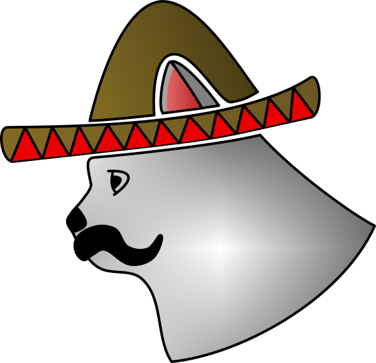

# El Decko
El Decko is a collection of user interfaces, backends, the El Decko Core and other utilities to make use of Elgato Stream Decks on Linux.

## Desing Goals
El Decko aims to be operable rootless and on any (or no) display server.  
Additionally El Decko tries to embrace the Unix philosophy "Do one thing and do it well" as good as it can. Which is the main reason why the entire El Decko ecosystem is split among so many different projects.  

The major advantage is that El Decko is very modular and it is relatively easy to supply custom backends and is not limited to one GUI toolkit. Hence we can supply a Qt-based, GTK-baesd, Flutter-based or even, if we fell up for the challenge to support Windows, Winform-based UIs and make this tool better integrate in the native look and feel of the end users desktop.  
In return the install size can also be tailored to ones need.  

Flatpak is our planed major distribution platform but native packages for your distribution (currently only openSUSE) are build on [build.opensuse.org](https://build.opensuse.org/project/show/home:VortexAcherontic:ElDecko).  
Addionally you can get any El Decko component from pypi.org

**Get El Decko Core here:**  
Git-Repository: https://github.com/Z-Ray-Entertainment/el_decko_core  
PyPi: https://pypi.org/project/el-decko-core/  
 
## Available UIs
### GTK4
The GTK4 user interface is currently under heavy development and not really usable except for launching, stopping and reloading ed-core.  

Git-Repository: https://github.com/Z-Ray-Entertainment/el_decko_ui_gtk4

## Available Backends
### OBS Studio Websocket
Git-Repository: https://github.com/Z-Ray-Entertainment/el_decko_backend_obs_ws  
PyPi: https://pypi.org/project/el-decko-backend-obs-ws/  

### MPRIS 2 via dbus
Repository: https://github.com/Z-Ray-Entertainment/el_decko_backend_mpris  
PyPi: https://pypi.org/project/el-decko-backend-mpris/  
  
## Planed UIs
### Qt6
The developemtn of the Qt6 user interface has not yet be started but is on our road map.  
Gti-Repository: https://github.com/Z-Ray-Entertainment/el_decko_ui_qt6  

## Planed Backends
#### Keystroke
This backend currently bears some challenges as someone can not emulate keyboard button press without super user access on Linux.  
The only known rootless solution would be to make use of xdotool which would make this backend useless for Wayland users.  
Running it as root (which would require the entire ed-core to run as root) is contradicting with the rootless approach.  
Some solutions might be to provide some kind of an el-decko-service which in return would run as root but doesn't require other parts of El Decko to do so or trying to send keyboards instructions via dbus.  
A major downside of the el-decko-service approach would be it partially breaks flatpak support in advance as the user is still required to install this service on the host OS.  
Repository: https://github.com/Z-Ray-Entertainment/el_decko_backend_keystroke
  
## Dropped backends / UIs
### TUI (Terminal user interface)
The TUI was originally planed as a standalone terminal based interface but was dropped as the core of El Decko (ed-core) can be run as a standalone application already.  
All configurations are stored as well-formed JSON files allowing for easy readability and shouldn't be very difficult to be edited by hand.  
As users usually asking for TUIs are also most likely users not wanting too much bloat on their systems they probably won't install an additional interface if they could just use vim and launch ed-core by hand.

## FAQ:
### Why is it called El Decko?
El Decko is kind of a short version of Elgato Stream Deck but I got rid of the Gato and Stream and the name became El Deck.  
But I felt like El Deck wasn't very memorizable so I added an O to make it sound like some spanish or mexican mystical creature.  
So it became El Decko.  

### Why is the logo a cat, wearing a sombrero and with a mustache?
Well, this is kind of a dad joke.  
Elgato does sond like el gato in spanish which is a male cat.  
In addition to the name I already came up with "El Decko" my initial thought was that this mystical creature could be a cat with a mustache wearing a sombrero.  
This is how the logo was born.  
